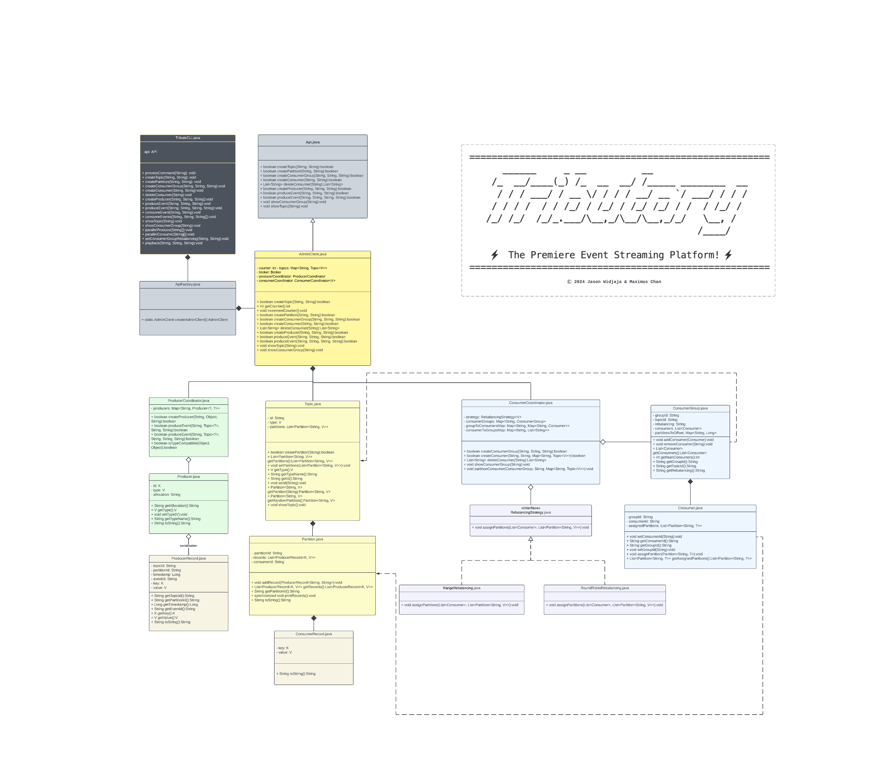

### YOUTUBE LINK https://youtu.be/9iNplsP8I0U

### 5.2.1. Task 3) Final Design (15 marks)

In a second blog post you will need to write in essence a report on your final solution. Your blog post will need to contain:

## Your final testing plan and your final list of usability tests;

Our final list of usability tests and testing plan has not changed thus far. Thus our usability tests consists of

Basic Tests:
1. Topic creation
2. Partition creation
3. Consumer group creation
4. Create consumer for consumer group
5. Create consumer for consumer group with same name
6. Create producer
7. Create producer of the same name
8. Show topics
9. Show consumers
10. Rebalance and see if output is correct
11. Rebalance and see if consumers are reallocated
12. Create events
13. Create mutiple events
14. Consume events for single consumers
15. Consume event for multiple consumers
16. Playback events to see if consumer keeps track of events correctly

Advanced Tests:
17. Parallel production test (check to see if produced in the correct order)
18. Parallel consumption tests
19. Parallel production test with multiple partitions
20. Parallel consumption tests with one topic

With our unit testing comprising of
 1. Component Testing
    Test to see if each of the objects we have made fulfills their functionality. This begins with the tributary, then the producer, the consumers, and then the concurrent features
 2. Integration Testing
    Once all the components are put together, The features are tested together to see if they can form a cohesive unit. Examples of such testing is:
    1. Producing events then consuming events
    2. Producing multiple events for multiple partitions
    3. Check if rebalance behavior is as expected
    4. And such.
    
Additionally, 
Our group used extensive automated usabiliity testing through bash scripting

## An overview of the Design Patterns used in your solution;
Our solution made extensive use of the strategy pattern. The rebalance strategy was always abstracted away. If a user were to one day decide to modify the API, they could also create their own strategy. Another implementation was that of the observer pattern where the 

## Explanation of how you accommodated for the design considerations in your solution;
The design considerations that we made earlier helped in building an outline for the program. The file structure we outlined ended up being used in the final project. The design patterns were also used in the building of the project

## Your final UML diagram; and
In our final UML it remains mostly the same. The only difference being that consumers depend on partition and consumerCoordinators depend on topic.

## A brief reflection on the assignment, including on the challenges you faced and whether you changed your development approach. We will use this blog post and your code to assess the overall design of your solution.
We feel that our current implementation is fulfills what we set out to build quite well in the beginning. Perhaps one thing we would change is the addition of more testing and also testing to see if how extendable the classes are. 

Our key challenges along the way were:
- Deciding how to build the tributary system
- Concurrency issues
- Processing JSON into objects that we can interact with
- General programming with generics

### YOUTUBE LINK https://youtu.be/9iNplsP8I0U